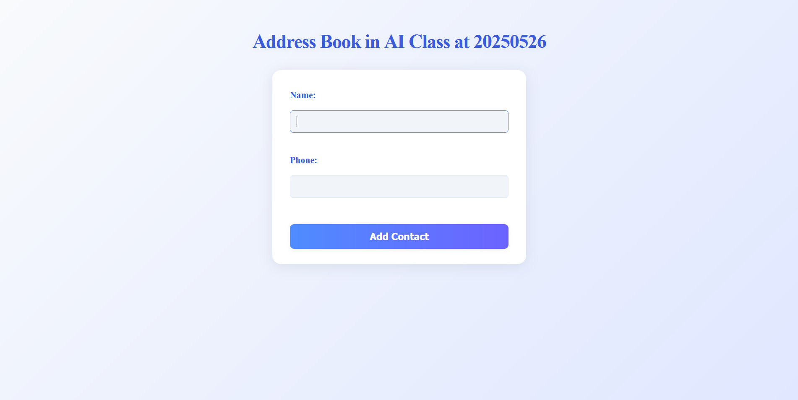

# python FLASK를 이용해 간단한 webAPP을 만들어봤습니다.
## 1. 먼저 웹 애플리케이션을 담당하는 코드(app.py)를 만듭니다.
### 해당 코드는 Flask를 이용해 정보들을 입력받아 addbook.txt에 저장하고 특정 이름이 입력되었을 때 해당 html 파일을 출력하는 코드입니다.
<pre>
  <code>
    from flask import Flask, render_template, request, redirect
    import csv

    app = Flask(__name__)
    
    # Route for the home page
    @app.route('/')
    def index():
        return render_template('index.html')
    
    # Route to handle form submission
    @app.route('/add', methods=['POST'])
    def add_contact():
        name = request.form['pyName']
        phone = request.form['pyPhone']
    
        # Save to addbook.txt in CSV format
        with open('addbook.txt', 'a', newline='', encoding='utf-8') as file:
            writer = csv.writer(file)
            writer.writerow([name, phone])
        if name.strip().upper() == "YUJIN":
            return render_template('yujin.html')
    
        return redirect('/')
    
    if __name__ == '__main__':
        app.run(debug=True)
  </code>
</pre>

## 2. 이름과 전화번호를 입력받는 폼을 구성하는 html 파일을 만듭니다.
### index.html
```
<!DOCTYPE html>
<html lang="en">
<head>
    <meta charset="UTF-8">
    <meta name="viewport" content="width=device-width, initial-scale=1.0">
    <title>Address Book</title>
    <link rel="stylesheet" href="{{ url_for('static', filename='style.css') }}">
</head>
<body>
    <h1>Address Book in AI Class at 20250526</h1>
    <form action="/add" method="post">
        <label for="name">Name:</label>
        <input type="text" id="htmlName" name="pyName" required>
        <br><br>
        <label for="phone">Phone:</label>
        <input type="text" id="htmlPhone" name="pyPhone" required>
        <br><br>
        <!-- 이 폼을 제출하면 /add 경로로 POST 요청이 파이썬으로 전송된다.-->
        <button type="submit">Add Contact</button>
    </form>
</body>
</html>
```
## 3. 특정 이름이 입력되었을 때 보여줄 html 파일도 만들어줍니다.
### yujin.html
```
<!DOCTYPE html>
<html lang="ko">
  <head>
    <meta charset="UTF-8">
    <title>YUJIN</title>
  </head>
  <body>
    <h1>Hello YUJIN</h1>
    
  </body>
</html>
```
## 결과물
### 메인 창

### 이름 YUJIN 입력하면 나오는 창

